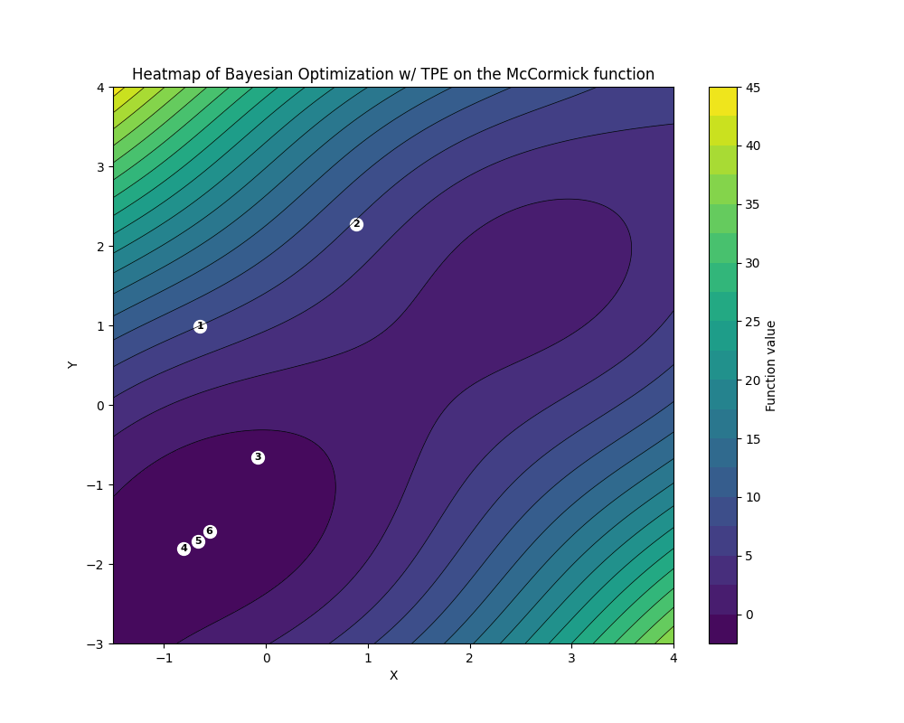

# Examples

## McCormick Function

The McCormick function is a multimodal function that is commonly used to test optimization algorithms. It is defined as `f(x,y) = sin(x + y) + (x - y)**2 - 1.5*x + 2.5*y + 1` along the domain `[-1.5, 4] x [-3, 4]`. The global minimum of this function is located at `f(-0.54719, -1.54719) = -1.9133`.

We implement the McCormick function as follows:
```python
import numpy as np
def objective(params):
    x, y = params
    return np.sin(x + y) + (x - y)**2 - 1.5*x + 2.5*y + 1
```

We then define our search space:
```python
lower_bounds = [-1.5, -3]
upper_bounds = [4, 4]
```

Finally, we run our bayesian optimization algorithm. We choose to run the algorithm for only 20 iterations, with 50 initial samples:
```python
from quickopt.bayesopt_tpe import bayesopt_tpe
result = bayesopt_tpe(funct=objective, space_min=lower_bounds, space_max=upper_bounds, iterations=20, samples=50, verbose=1)
```

The following is a heatmap of the optimization process, with each point representing a new optimal solution found by the algorithm:




