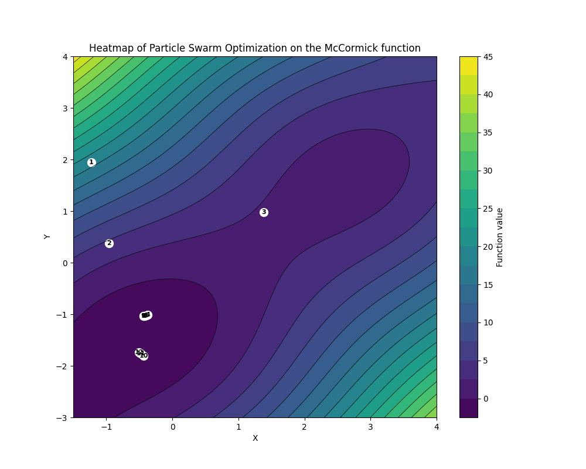

# Examples

## McCormick Function

The McCormick function is a multimodal function that is commonly used to test optimization algorithms. It is defined as `f(x,y) = sin(x + y) + (x - y)**2 - 1.5*x + 2.5*y + 1` along the domain `[-1.5, 4] x [-3, 4]`. The global minimum of this function is located at `f(-0.54719, -1.54719) = -1.9133`.

We implement the McCormick function as follows (note `pso` maximizes fitness, so we negate the function):
```python
def objective(params):
    x, y = params
    return -(np.sin(x + y) + (x - y)**2 - 1.5*x + 2.5*y + 1)
```

We then define our search space:
```python
space_min = [-1.5, -3]
space_max = [4, 4]
```

Finally, we run our particle swarm optimization. We choose to run the algorithm for 10 iterations, with a swarm size of 50 particles, alongside the default inertia, cognitive, and social weights, as well as the default velocity clamping of `0.1`:
```python
result = quickopt.pso(objective=objective, space_min=space_min, space_max=space_max, iterations=10, swarm_size=50, verbose=1)
```

The following is a heatmap of the optimization process, with each point representing a new optimal solution found by the algorithm:




